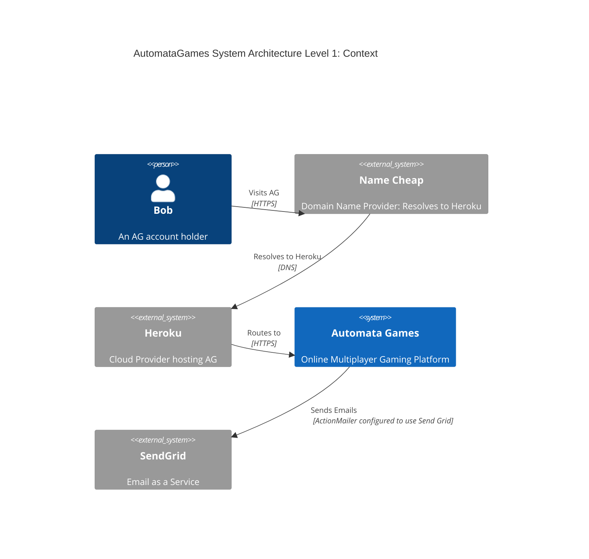
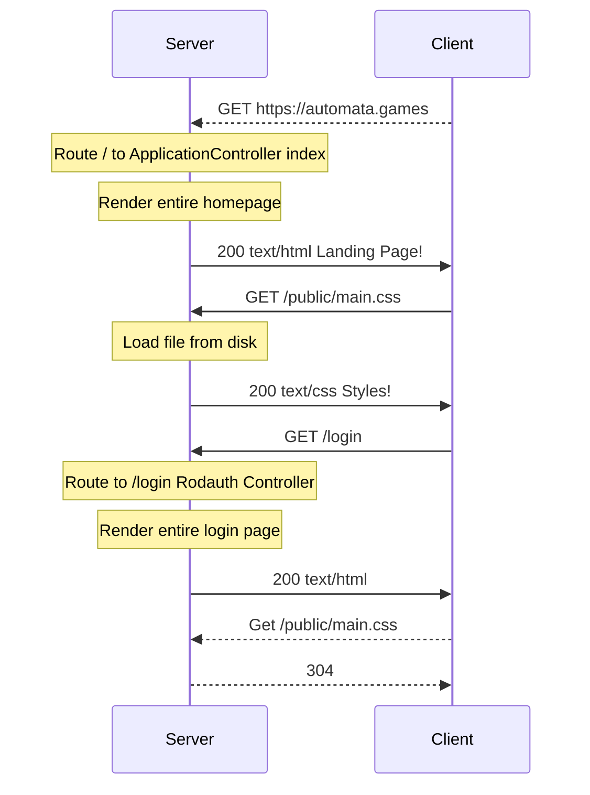

# The Goal
Provide a high level understanding of the major components of this web application architecture so the reader knows where to look next to learn more about any given part.

# The Audience
This guide assumes the reader knows little about web application development and will cover some history and context that someone with experience in this area can freely skip.

# Diagrams
We use the [C4 Model](https://c4model.com/) approach to diagramming software architecture.

**<abbr title="Automata Games">AG</abbr>** is shorthand for **Automata Games**.

## Level 1: Context of the System

### [Name Cheap]
NameCheap is our DNS provider. This is where `automata.games`, our <abbr title="Top level Domain">TLD</abbr>, is registered.

### [Heroku]
Heroku is our cloud provider. It is where we deploy and run our application + managed resources our application needs like databases.

### [SendGrid]
SendGrid is our email as a service provider. Other services can be used like MailGun, but SendGrid has a good low-level free tier which is best for us at this stage. Plus, it's owned by Twilio, the dominant provider of text messaging as a service, which is pretty good, if we want to expand to SMS in the future.

## [Rails]: The Web Framework
[Rails] is a large opinionated, <abbr title="Model View Controller">MVC</abbr> (Model View Controller), web framework for Ruby. Rails handles a number of choices and problems. Some of the important ones to note are:
   * The [Puma web server](https://puma.io/puma/) (this is almost entirely opaque to us at present)
   * Database schema management ([migrations](https://guides.rubyonrails.org/active_record_migrations.html))
   * The use of [MVC (Model View Controller)](https://guides.rubyonrails.org/getting_started.html#mvc-and-you)
   * [ERB Templates] for Views (Embedded Ruby in HTML to generate HTML output)
   * [ActiveRecord]: The Rails ORM (Object-Relational-Model). The ORM provides Models (classes) in Rails with methods that translate into executed queries on the database. (i.e. We almost never have to write any SQL ourselves)
   * (*Not in use yet*) [ActiveJob]: Background job management with either ActiveJob (Rails built-in) or [Sidekiq].
   * (*Not in use yet*): [ActiveStorage]: Abstraction over files stored on S3, Azure, Google Cloud etc (think storage of assets and content like photos, PDFs, etc)
   * [PostgreSQL], because ActiveRecord wants you to use a SQL style DB 
   * [ActionCable]: WebSockets made easy on the server.
   * [ActionMailer]: Email templates and sending made easy. (Hooks up to a number of backends, we are using [SendGrid])
   * Sessions, various forms of security, CSRF protection, https enforcement, and more.
   * The [Rails CLI]. A powerful tool both for development and production debugging, management, and administration of the application (in particular the [Rails Console]).

All of this comes together in a unified web server that handles web requests and sends back html, css, and javascript. Rails' main focus is still on the classic client/server relationship looking something like this:

This classic back and forth between the client and server allows the creation of interactive applications, where most interaction is either a new GET request, and the server re-renders the whole new page and sends it back, or you POST from a form, and the response is again, an entire render of the page. Each render is handled by the server and can query the database, get whatever data is needed, and then dynamically generate the html response using ERB templates.

There are several nice aspects to this flow. Web browsers have been working with this flow for decades. Your browser can handle your history during page navigation. Any data needed as a part of rendering the page, is accessible from the controller doing the rendering. What this leaves out is interaction *within the page/application*. How are we going to build real-time games if the browser has to reload the whole page with every click of a tile or button? (Spoiler we won't).

## [Svelte]: Interaction in the Browser
Enter Javascript. Once we get an HTML response, that HTML can include a `<script>` tag telling the browser to download a script and run it within the sandbox of the browser. This lets us do all kinds of things, you have arbitrary code running in your browser! Browsers are almost like mini operating systems at this point. There's a ton of great info on what browsers can do on <abbr title="Mozilla Developer Network">[MDM]</abbr>.

### JS Frameworks
The code that you can download and run in the browser has evolved to the point that, like Rails, we have entire frameworks, for JS code running in the browser, handling things like "client-side" routing, and editing of the [DOM] (Document Object Model). These are things like ReactJS, AngularJS, VueJS, EmberJS, etc. You write a bunch of code, which relies on a runtime framework to operate and your web page must download your code + the framework. They are "big" (ish). Then it all runs at runtime, so you have to write a lot of tests, and do a lot of QA.

### [Svelte] is a *Compiler*

Unlike the frameworks, Svelte is a compiler. Given a "component", it will compile behavior, view logic, and optionally style, into raw vanilla JS that can directly update the DOM based on interaction. This results in *tiny* Javascript assets to load. They are faster, since they don't need to maintain a "virtual [DOM]" like most frameworks. It just updates the [DOM].

Because it's compiling as a build step to produce the JS that actually gets loaded by the browser, we also get more error checking and strictness than we otherwise would using JS, which is a big step forward for safety and developer experience.

### TODO: Diagram using Svelte with interactive local clicks, not reloading from the server.

# Credits
Many thanks to [this great blog post](https://dev.to/buhrmi/setting-up-a-new-rails-7-app-with-vite-inertia-and-svelte-c9e) by [Stefan Buhrmester](https://dev.to/buhrmi) for providing a great guide on the initial use of Rails + Svelte with Vite + InertiaJS. For a step by step guide on starting this architecture from scratch, read that blog post! (It does not cover adding Rodauth-Rails or any account management.)

[Rails]:https://rubyonrails.org/
[Sidekiq]:https://sidekiq.org/
[PostgreSQL]:https://www.postgresql.org/
[Svelte]:https://svelte.dev/
[TailWindCSS]: https://tailwindcss.com/
[Vite]: https://vitejs.dev/
[ActiveRecord]:https://guides.rubyonrails.org/active_record_basics.html
[ActiveJob]:https://guides.rubyonrails.org/active_job_basics.html
[ActionCable]:https://guides.rubyonrails.org/action_cable_overview.html
[ActionMailer]:https://guides.rubyonrails.org/action_mailer_basics.html
[ActiveStorage]:https://guides.rubyonrails.org/active_storage_overview.html
[Rails CLI]:https://guides.rubyonrails.org/command_line.html
[Rails Console]:https://guides.rubyonrails.org/command_line.html#bin-rails-console
[ERB Templates]:https://guides.rubyonrails.org/layouts_and_rendering.html
[SendGrid]:https://sendgrid.com/
[MDM]:https://developer.mozilla.org/en-US/
[DOM]:https://developer.mozilla.org/en-US/docs/Web/API/Document_Object_Model
[Name Cheap]:https://www.namecheap.com/
[Heroku]:https://dashboard.heroku.com/apps/automata-games
[SendGrid]:https://app.sendgrid.com/guide