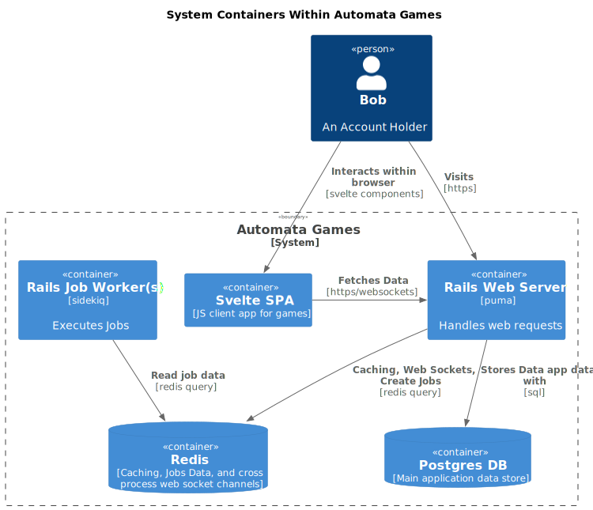
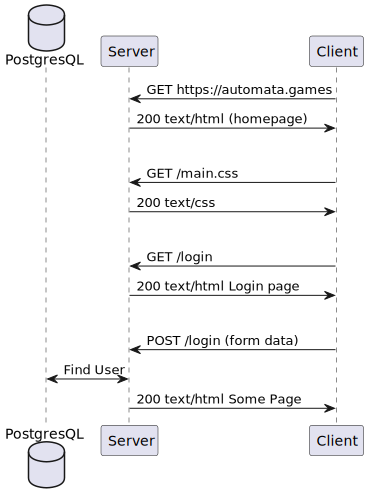
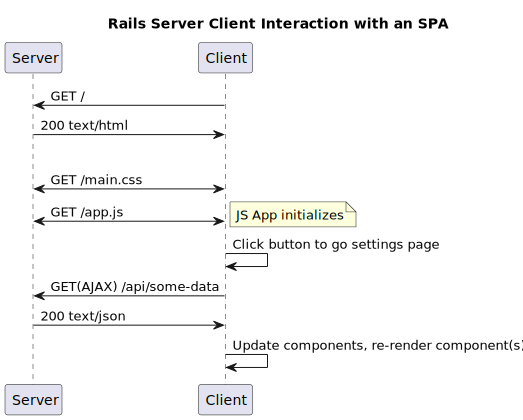
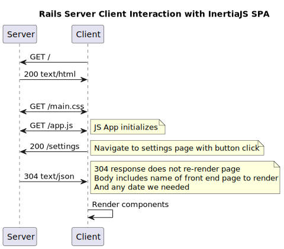

# Level 2: System Containers
This diagram zooms in one level to the `<<system>> Automata Games` from the [Level 1: Context Diagram](level1_context.md) and ignores the larger external systems as they are mostly opaque to AG.

The focus here is on the "containers" or mostly independently deployable parts of AG.

## [Rails]: The Web Framework
[Rails] is a large opinionated, <abbr title="Model View Controller">MVC</abbr> (Model View Controller), web framework for Ruby. Rails handles a number of choices and problems. Some of the important ones to note are:
   * The [Puma web server](https://puma.io/puma/) (this is almost entirely opaque to us at present)
   * Database schema management ([migrations](https://guides.rubyonrails.org/active_record_migrations.html))
   * The use of [MVC (Model View Controller)](https://guides.rubyonrails.org/getting_started.html#mvc-and-you)
   * [ERB Templates] for Views (Embedded Ruby in HTML to generate HTML output)
   * [ActiveRecord]: The Rails ORM (Object-Relational-Model). The ORM provides Models (classes) in Rails with methods that translate into executed queries on the database. (i.e. We almost never have to write any SQL ourselves)
   * (*Not in use yet*) [ActiveJob]: Background job management with either ActiveJob (Rails built-in) or [Sidekiq].
   * (*Not in use yet*): [ActiveStorage]: Abstraction over files stored on S3, Azure, Google Cloud etc (think storage of assets and content like photos, PDFs, etc)
   * [PostgreSQL], because ActiveRecord wants you to use a SQL style DB 
   * [ActionCable]: WebSockets made easy on the server.
   * [ActionMailer]: Email templates and sending made easy. (Hooks up to a number of backends, we are using [SendGrid])
   * Sessions, various forms of security, CSRF protection, https enforcement, and more.
   * The [Rails CLI]. A powerful tool both for development and production debugging, management, and administration of the application (in particular the [Rails Console]).

All of this comes together in a unified web server that handles web requests and sends back html, css, and javascript. Rails' main focus is still on the classic client/server relationship looking something like this:

### Interaction without Javascript `[background]`
This classic back and forth between the client and server allows the creation of interactive applications, where most interaction is either a new GET request, and the server re-renders the whole new page and sends it back, or you POST from a form, and the response is again, an entire render of the page. Each render is handled by the server and can query the database, get whatever data is needed, and then dynamically generate the html response using ERB templates.

There are several nice aspects to this flow. Web browsers have been working with this flow for decades. Your browser can handle your history during page navigation. Any data needed as a part of rendering the page, is accessible from the controller doing the rendering. What this leaves out is interaction *within the page/application*. How are we going to build real-time games if the browser has to reload the whole page with every click of a tile or button? (Spoiler we won't).

## Interaction in the Browser

### Enter JavaScript `[background]`
Enter Javascript. Once we get an HTML response, that HTML can include a `<script>` tag telling the browser to download a script and run it within the sandbox of the browser. This lets us do all kinds of things, you have arbitrary code running in your browser! Browsers are almost like mini operating systems at this point. There's a ton of great info on what browsers can do on <abbr title="Mozilla Developer Network">[MDM]</abbr>.

### JS Frameworks `[background]`
The code that you can download and run in the browser has evolved to the point that, like Rails, we have entire frameworks, for JS code running in the browser, handling things like "client-side" routing, and editing of the [DOM] (Document Object Model). These are things like ReactJS, AngularJS, VueJS, EmberJS, etc. You write a bunch of code, which relies on a runtime framework to operate and your web page must download your code + the framework. They are "big" (ish). Then it all runs at runtime, so you have to write a lot of tests, and do a lot of QA.

## [Svelte] is a *Compiler* `[svelte background]`

Unlike most JS frameworks, [Svelte] is a compiler. Given a `component.svelte` "component file", it will compile behavior, view, and optionally style, into raw vanilla JS that can directly update the DOM based on interaction or reaction to events. This results in *tiny* Javascript assets. They are faster to download because of their size. They are faster to run because they don't need to maintain a "virtual [DOM]" like most frameworks. It just updates the [DOM].

Because it's compiling as a build step to produce the JS that actually gets loaded by the browser, we also get more error checking and strictness than we otherwise would using JS, which is a big step forward for safety and developer experience.

## How does [Svelte] (or any <abbr title="Single Page Application">SPA</abbr>) augment the experience with Rails?

An <abbr title="Single Page Application">SPA</abbr> is usually loaded after a normal html response from Rails, where the HTML includes a script tag for a JS script which could be a large minified bundle of JS which loads the SPA app on download, and from there on takes over the interaction of the browser.

This takeover usually includes:
* Preventing default click events so the JS can handle them instead of submitting a request to the server.
* Controlling URL routing, locally in the browser.
* Interacting with the server via <abbr title="Asynchronous JavaScript and XML">AJAX</abbr> requests or web sockets instead of full http requests.
* Sometimes maintaining a Virtual/Shadow DOM, and running a rendering engine that handles updates to the DOM (But we don't do this with Svelte).

So with an SPA, our relationship starts to look more like this:

## [IntertiaJS]: Using Server Side Routing in our SPA!

In Automata, we're using [IntertiaJs], which provides a small layer of logic on both the front end SPA, and the Rails server for communicating over https specifically to handle routing. This means we can implement all our routing for the front-end SPA in our normal server side routing logic, the same way we do for all non-SPA style pages within the Rails app!

Inertia does this by using a header `x-inertia` to indicate a request is an inertia request, and that the server can respond with instructions to render a front-end component or page, and with data! 

This approach has some nice benefits:
* the browser maintain URL history normally we need not do anything special
* No front end routing library needed, making our front end lighter weight
* Page navigation is still very fast, because the responses from the server only contain data and the name of the page to be rendering.
* Because we are using Svelte - the re-rendering is also happening faster than a normal front end framework using React, etc.

This changes our interaction to this:

## [Back to Architecture](../architecture.md)

[Rails]:https://rubyonrails.org/
[Sidekiq]:https://sidekiq.org/
[PostgreSQL]:https://www.postgresql.org/
[Svelte]:https://svelte.dev/
[TailWindCSS]: https://tailwindcss.com/
[Vite]: https://vitejs.dev/
[IntertiaJs]:https://inertiajs.com/
[ActiveRecord]:https://guides.rubyonrails.org/active_record_basics.html
[ActiveJob]:https://guides.rubyonrails.org/active_job_basics.html
[ActionCable]:https://guides.rubyonrails.org/action_cable_overview.html
[ActionMailer]:https://guides.rubyonrails.org/action_mailer_basics.html
[ActiveStorage]:https://guides.rubyonrails.org/active_storage_overview.html
[Rails CLI]:https://guides.rubyonrails.org/command_line.html
[Rails Console]:https://guides.rubyonrails.org/command_line.html#bin-rails-console
[ERB Templates]:https://guides.rubyonrails.org/layouts_and_rendering.html
[SendGrid]:https://sendgrid.com/
[MDM]:https://developer.mozilla.org/en-US/
[DOM]:https://developer.mozilla.org/en-US/docs/Web/API/Document_Object_Model
